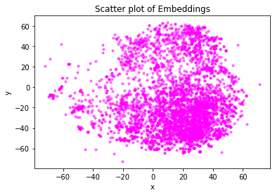
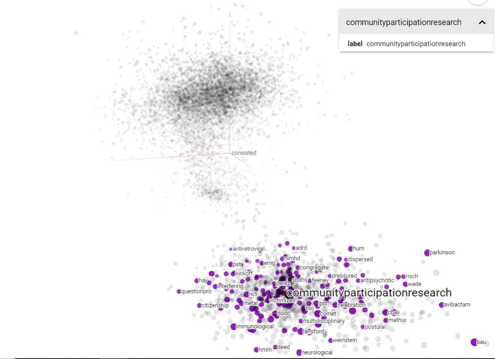
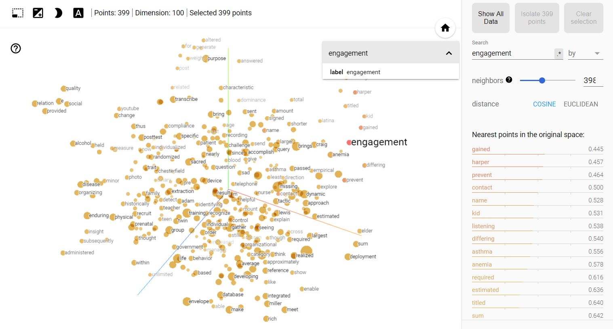
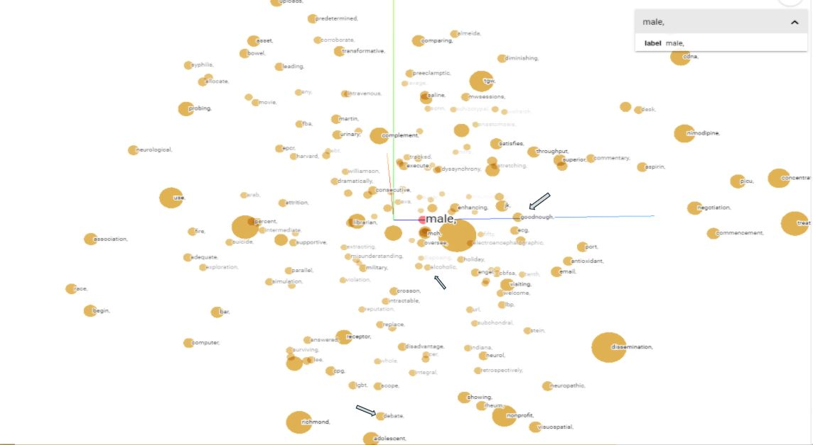
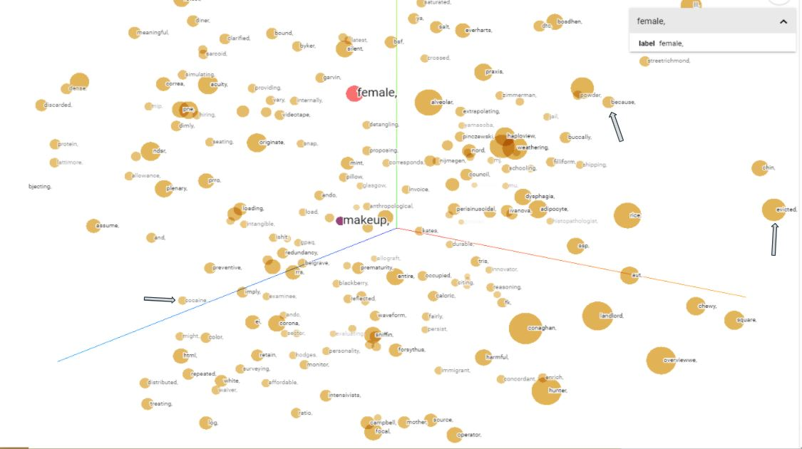
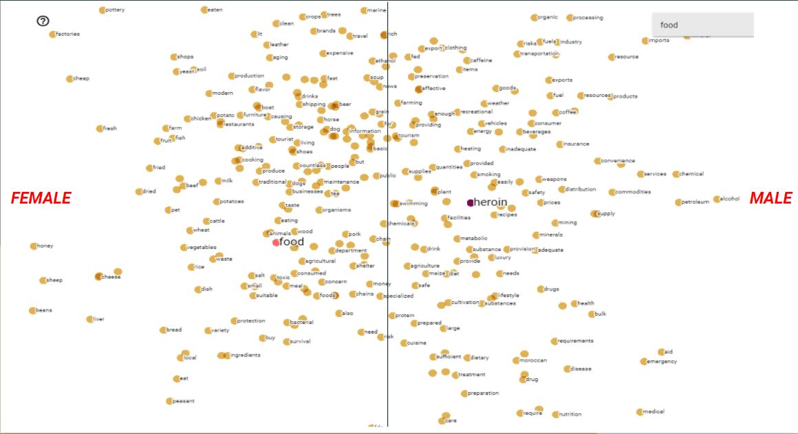

# Visualizing Word Embeddings using Google's embedding projector
Why import the TSNE package in your Python environment when a few simple steps can give you way more interaction and FUN with your data? Thanks to Google we can see how our textual data is being used to find out how words are similiar in how they were written. 


# Objective
Our objective is to analyze text data, as in qualitative data, i.e. Research papers, tweets, texts, etc. In order to do that you need these things called Word Embeddings. This is taking words from a particular dataset and turning them into meaningful numbers that can be plotted on a graph(aka vector)

# Purpose
- Computers cannot understand words 
- It brings meaning to how words are being used
- It is super fun

We do this because computers cannot understand words, they only know numbers, so if you want to run any sort of analysis on text data you have to turn it into numbers. Instead of randomly assigning each word in a text a number or counting them, it makes sense to turn these words into **meaningful** numbers so that way when we run an analysis on how words are being used we can see how different they are or similar in your data. 

# Implementation

There are multiple ways of doing this, a way that I did it was downloading a pre-trained word embedding model called GloVe, that can create those meaningful vectors for you (there are other ones besides GloVe). 
GloVe embedddings(https://nlp.stanford.edu/projects/glove/), downloadable code is in Python file.

My motivation behind this was once you build your deep learning algorithim, it really makes sense to see how your data interacts and so why would I use something like this:<br />

<div align="center"> </div>
# When I can use something like this: 
<br />
<br />
<div align="center"></div>
  
 Below is a powerpoint that can show more:
https://github.com/brianferrell787/Interactive-Word-Embedding-Projector-from-Google-of-your-trained-neural-network/blob/master/Word%20Embeddings.pdf

# Benefits
Once you upload your word emebeddings and metadata in the projector you can search words, and see the top N words associated to it. Like this:

<div align="left"></div>
  
<div align="left"></div>

You can see what words are mostly associated with the word "male" if your data has it: <br />
<div align="left"></div>
You can see what words are mostly associated with the word "female" if your data has it: <br />
<div align="left"></div>
You can even see how male and female compare to the word "food": <br />
<div align="left"></div>

### ISN'T THIS FUN!!!! :)

# Final Remarks
- Remember you have to have your own trained deep learning algorithim
- Watch this Youtube: https://www.youtube.com/watch?v=ulLx2iPTIcs
- Website for projector: https://projector.tensorflow.org/
- Learn TSNE and PCA: https://distill.pub/2016/misread-tsne/
- Have fun! Code is implemented above

At the end of the code there is a way to download the embeddings and words into a TSV file that looks like this 
``` Python
import io

out_v = io.open('embeddings.tsv', 'w', encoding='utf-8')

for num in embedding_matrix:
 
  out_v.write('\t'.join([str(x) for x in num]) + "\n")
out_v.close()
```
``` Python
import io

out_m = io.open('metadata.tsv', 'w', encoding='utf-8')


for word in word_list[:19000]:
 
  
  out_m.write(word + "\n")
  

out_m.close()
```
``` Python
try:
  from google.colab import files
except ImportError:
   pass
else:
  files.download('metadata.tsv')
  files.download('embeddings.tsv')
```


